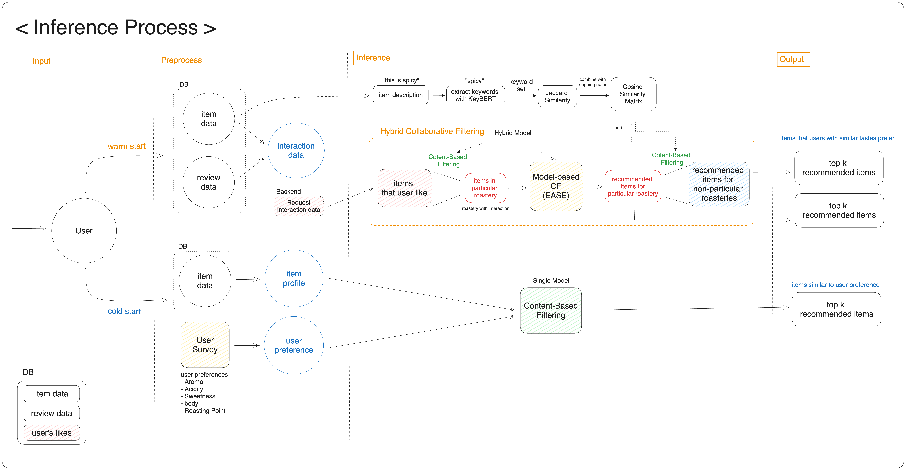
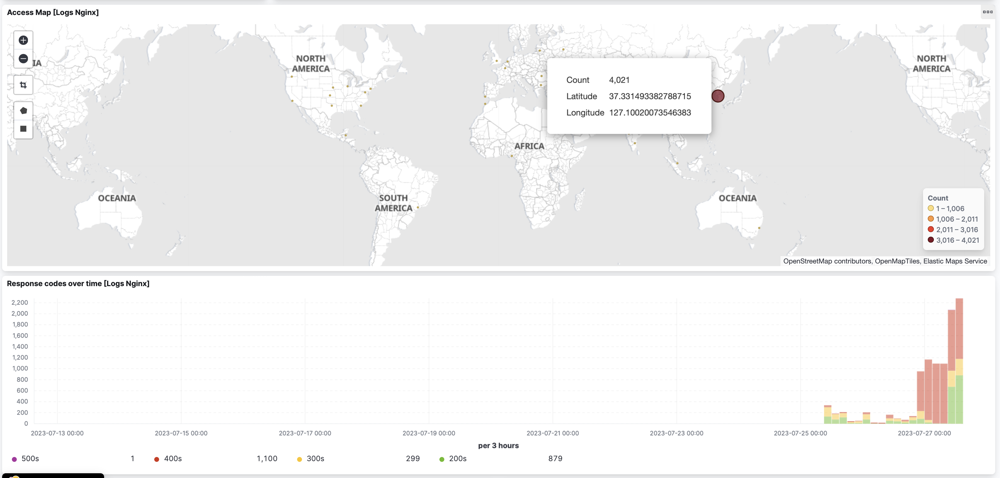
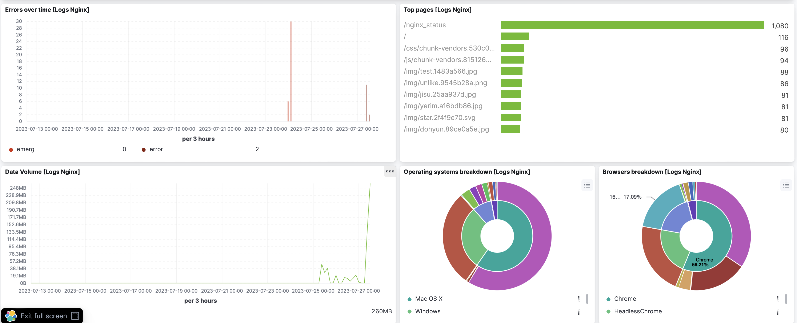
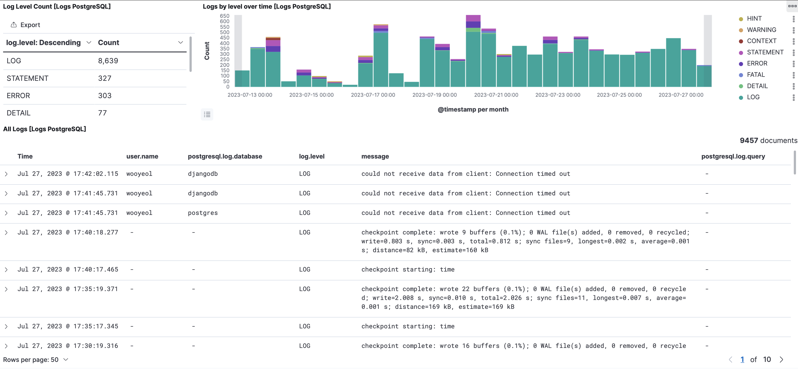

# COFFEE PLAYLIST

Web Application Service for Coffee Recomendation System

- main page
  
- coffee recomendation (contents based filtering)
  
- mypage (interaction & collaborative filtering)
  
- coffee products (filtering)
  

# SOFTWARE ARCHITECTURE

# MODEL INFERENCE PROCESS

# ELK - WEB MONITERING SYSTEM

# APPENDIX

- About Us

|  |  |  |  |  |
| :------------------------------------------------------------------------: | :------------------------------------------------------------------------: | :------------------------------------------------------------------------: | :------------------------------------------------------------------------: | :------------------------------------------------------------------------: |
|                   [김수민](https://github.com/ksumini)                   |                   [박예림](https://github.com/y2r1m)                   |                   [임도현](https://github.com/limstonestone)                    |                 [임우열](https://github.com/Woo-Yeol)                 |                   [임지수](https://github.com/zsmalla)                    |
|             데이터 수집 및 전처리  Airflow 배치 데이터 ETL 파이프라인 구축  웹사이트 Wireframe 설계                    |                추천시스템 모델링   데이터 전처리 및 피처 엔지니어링                |                     추천시스템 모델링   MLflow 실험 파이프라인 구축   모델 inference 서빙                     |                Software Architecture 설계   ELK-Stack 구현   Back-End Engineering                 |          Front-End Engineering   UI/UX 디자인   데이터 수집 및 전처리           |

- [Project Introduction(notion)](https://boostcampait.notion.site/RecSys-04-COFFEE-PLAYLIST-bc692ede39ad4e63b2c936b5d348444d?pvs=4)
- Wrap-up report
- Demo Video