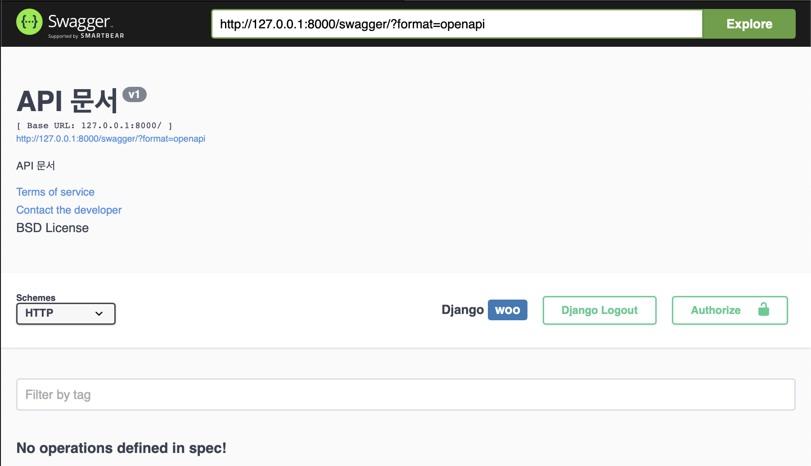
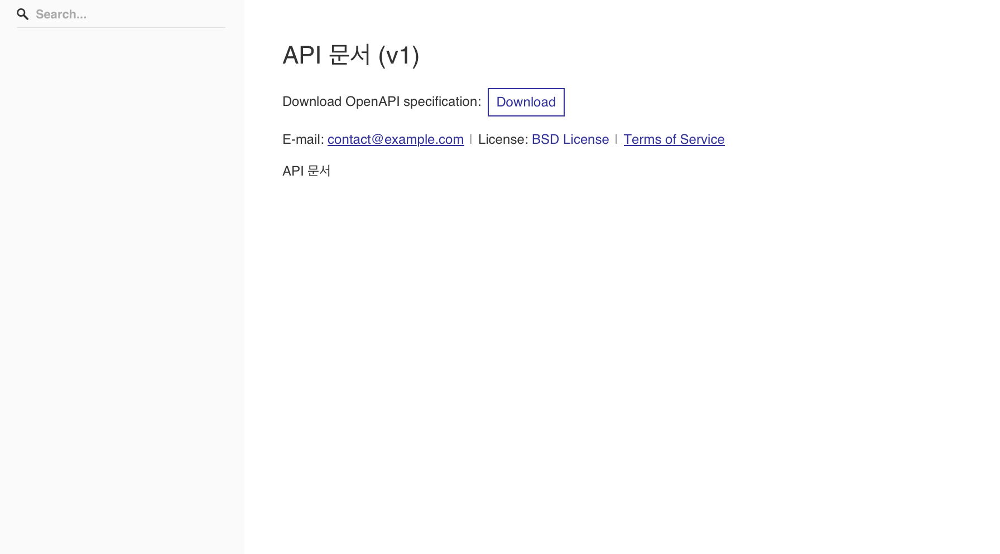

# Swagger & Redoc

Swagger와 ReDoc은 모두 API 문서화 및 시각화 도구입니다.

## Swagger

- Swagger:
  - Swagger는 API를 문서화하고 시각적으로 표현하기 위한 프레임워크입니다.
  - Swagger는 OpenAPI Specification(OAS)라는 API 설계 및 문서화를 위한 표준 스펙을 사용합니다.
  - Swagger는 API 엔드포인트, 요청/응답의 구조, 매개변수, 헤더, 오류 응답 등을 포함한 자세한 API 문서를 생성합니다.
  - Swagger UI를 통해 API 문서를 시각적으로 탐색하고 테스트할 수 있습니다.

## Redoc

- ReDoc:
  - ReDoc는 Swagger로 작성된 API 문서를 아름답고 간결하게 렌더링하는 도구입니다.
  - Swagger 문서를 재구성하여 사용자 친화적이고 시각적으로 매력적인 방식으로 표현합니다.
  - ReDoc UI는 단순하고 직관적인 디자인을 가지며, 사용자가 API를 이해하고 상호 작용할 수 있도록 돕습니다.
  - Django REST Framework와 통합하여 Swagger와 ReDoc를 사용하면 API 문서를 자동으로 생성하고 시각화할 수 있습니다. 이는 개발자들에게 API의 엔드포인트, 요청/응답 구조, 매개변수 등을 명확하게 이해하고 API를 테스트하는 데 도움을 줍니다.
